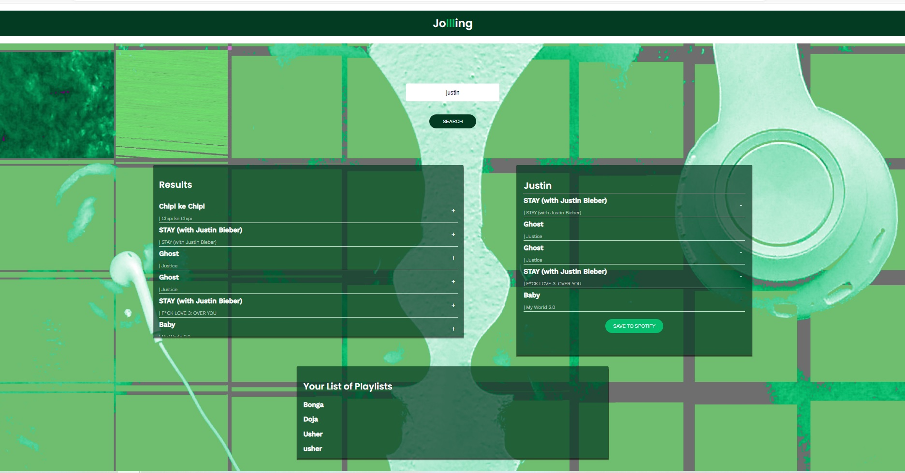

# Codecademy Jammming Project - Part 1 & Part 2

Part 1 of the Project

In this project, I built a React web application called Jammming. I will use my knowledge of React components, passing state, and requests with the Spotify API to build a website that allows users to search the Spotify library, create a custom playlist, then save it to their Spotify account. I managed to do this.

Due to security changes in how the Spotify API handles authentication for non-published applications (and Jammming does not fit the application criteria for an extension/removal of these restrictions), only the user who has registered the application is able to log into the OAUTH screen to therefore log into their Jammming app, and any other user must be manually added as an authorised tested from the Spotify Developer Dashboard panel for that app before they can.

Part 2 of the Project

To give users the ability to update all of their Spotify playlists and save them to Spotify. I really struggled doing this but manage to get quiet far. I did not complete this and will return to fix the bugs when i finish in due time.

## Table of Contents

- [Licence](#licence)
- [General Info](#general-information)
- [Technologies Used](#technologies-used)
- [Screenshots](#screenshots)
- [Setup](#setup)
- [Project Status](#project-status)
- [Acknowledgements](#acknowledgements)
- [Contact](#contact)

<!-- * [License](#license) -->

## Licence

This project is open source. Personal logos and images should not be used without authorization.

## General Information

- This is a Codecademy project using the React library
- Project Objectives:
  - Create a React Application
  - Create Static Components
  - Pass Down Search Result and Render Result List
  - Pass down Playlist to TrackList
  - Add Tracks to a Playlist
  - Remove Tracks from a Playlist
  - Change the Name of a Playlist
  - Create a Method that Saves the Playlist to a User's Account
  - Hook up Search Bar to Spotify Search
  - Obtain a Spotify Access Token
  - Implement Spotify Search Request
  - Save a User's Playlist
  - Deploy
  - Displays a list of the current user's playlists
  - Allows a user to select one of their existing playlists
  - The user may update the name and/or the tracks of the playlist and click "SAVE PLAYLIST"
  - If the user selects a different playlist while the current playlist has unsaved changes, Jammming will load and display the new playlist
  <!-- You don't have to answer all the questions - just the ones relevant to your project. -->

## Technologies Used

- VSCode - version 1.60.2
- Google Chrome (browser)
- Git and GitHub

## Screenshots Part 1

## Screenshots Part 2

## Setup

To navigate to the website use the following link:
[Jammming web app](christsadi.github.io/jammming-jolllling)

You will find all the files and images which make up this website on this repository.

## Project Status

I will revisit and add more to this project as i progress in my course.

## Acknowledgements

- This project was based on <https://www.codecademy.com/paths/full-stack-engineer-career-path/tracks/fscp-22-react-part-ii/modules/wdcp-22-jammming/projects/jammming-prj>.

- Many thanks to codecademy for this exposure.

## Contact

Created by [@Christ Sadi) - feel free to contact me!
